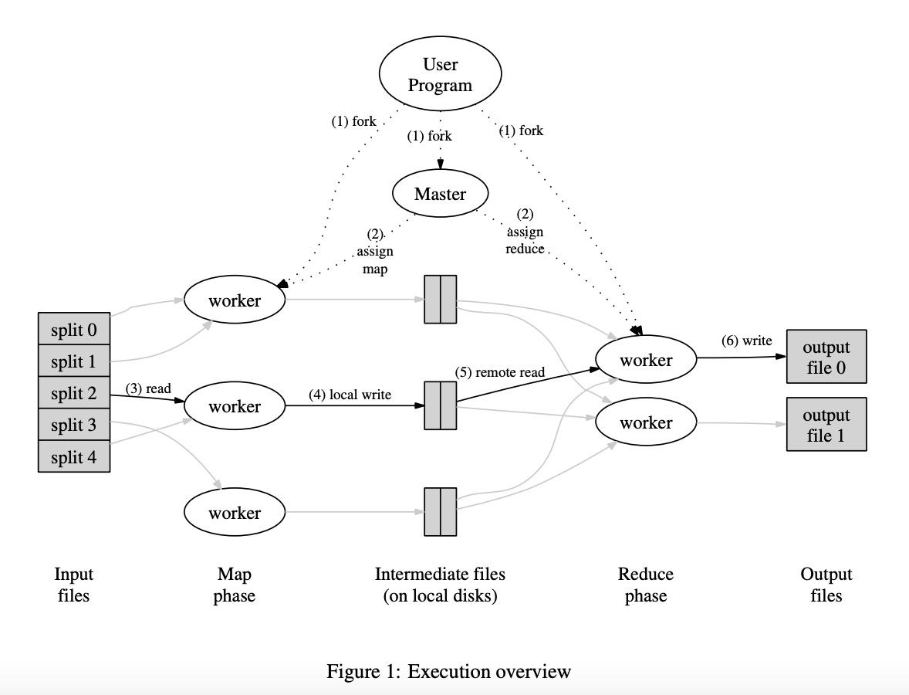

# 实现一个分布式MapReduce【1】论文笔记
## 【1】论文笔记
通读[MapReduce论文](https://pdos.csail.mit.edu/6.824/papers/mapreduce.pdf)，搜索、消化、提炼以下关键信息：
- **背景**
    1. 函数式语言（如Lisp）中的Map、Reduce函数是MapReduce系统的灵感来源；MapReduce利用map函数来处理数据，用reduce函数合并数据，并且把这种思想应用在大规模的集群环境中，实现分布式地海量数据处理
    2. 对于用户(MapReduce的使用者)而言：MapReduce是一种抽象化的编程模型，它隐藏了分布式数据处理的细节，仅对外暴露map和reduce的抽象,用户来实现具体的map和reduce功能
    3. MapReduce自身关注的是并行计算、容错、分布式数据、负载均衡等一系列问题，并且保证分布计算的结果和无错误的串形计算的结果一致
- **应用场景**\
    文中列举的应用场景有：统计url访问频率、统计词频、分布式的查找和排列、倒置索引等[1]；\
    原论文发布至今已有18年之久，当前，MapReduce已经应用于更加广泛的领域，例如：
    1. MapReduce框架的开源实现：Hadoop[2];
    2. 用于日志分析: 过滤事件、聚合、挖掘特定数据模式[3]
    3. 用于生物学领域如：DNA测序[4]
    
    也有一些非常有意思的质疑：
    - 比如David DeWi认为MapReduce这种利用大量并行工作的低端处理器来解决计算问题的模式是一种倒退，使得⼤规模数据密集型编程回退到1960年以前据库管理系统还没有发明的时代。[5]\
    这个观点很精彩，单从数据库社区的角度来看MapReduce，确实存在一些不成熟的实现：比如缺少索引、事务和完整性约束功能、在map worker拉数据时的磁盘寻址时间过长等。
    - 上述这些观点或许可以成为MapReduce进化的方向；尝试在网上找到了一个MapReduce2.0的概念[6],但是这个概念并没有从数据库系统设计角度去迭代MapReduce，更关注如何做集群拓展和高可用。
    - 或许这也是MapReduce系统想要做到和区分于传统数据库的一种差异化策略？因为本身将原始数据存入数据库就多了一步抽象的处理，
- 实现\
    \
    以上是MapReduce数据处理的流程图，MapReduce集群由一个master和多个worker组成，最终目的是将输入文件按照用户定义的处理方式（map和reduce函数）处理并输出成输出文件
    具体过程如下：
    1. 用户程序将输入文件切分成大小可配置的16～64MB片段，然后在多个集群中的节点上启动用户程序
    2. master节点分配map和reduce的任务给空闲的worker节点
    3. 被分配到map任务的worker节点读取对应输入文件的内容，将k/v从输入文件中拿出来给map函数处理，中间状态的k/v（处理的结果）会存在worker节点的内存里
    4. worker内存里的中间状态k/v会周期性的写入本地硬盘，并且由**分区函数**分区至R区域中，最后这些中间数据的地址会传给master节点，master节点会把这些地址转发给负责reduce的worker节点
    5. reduce worker被master通知数据地址后，它用RPC去读map节点上的中间数据，读完后再按key进行一次重新整理，以防止中间数据太大且key太多使内存爆满
    6. reduce worker将排序好的k/v输入reduce函数，并将函数输出追加写到输出文件

## 引用
[1] [MapReduce: Simplified Data Processing on Large Clusters](https://pdos.csail.mit.edu/6.824/papers/mapreduce.pdf)\
[2] [Hadoop: The definitive guide](https://book.douban.com/subject/27115351/)\
[3] [A comparison of join algorithms for log processing in MaPreduce](https://dl.acm.org/doi/abs/10.1145/1807167.1807273)\
[4] [The Genome Analysis Toolkit: A MapReduce framework for analyzing next-generation DNA sequencing data](https://genome.cshlp.org/content/20/9/1297.short)\
[5] [MapReduce: A major step backwards](https://www.dcs.bbk.ac.uk/~DELL/teaching/cc/paper/dbc08/dewitt_mr_db.pdf)\
[6] [Difference between MapReduce 1.0 and MapReduce 2.0](https://mydataexperiments.com/2013/11/11/difference-between-mapreduce-1-0-and-mapreduce-2-0/comment-page-1/)

